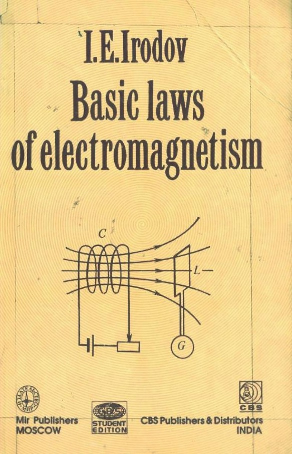

# PhysOlympicStash
A curated collection of top-tier physics books tailored for problem-solving and Olympiad preparation. This repository is a treasure trove for students and enthusiasts, featuring resources to master mechanics, electromagnetism, thermodynamics, and more.

## The Best Foundational Physics Books

### Level 0: Best Introductory Physics Book for School Students

For me, this is a Level-0 physics which thoroughly prepares you for the must-read Level-1 book mentioned below. 👇

[**Fundamentals Of Physics Extended, 10th Edition**](https://archive.org/details/fundamentals-of-physics) by David Halliday, Jearl Walker, and Robert Resnick

### ⚠️ Important Calculus Preparation

Before jumping on to the Level-1 book. Please go through this fantastic bedside calculus book by Tarasov and two volumes of Piskunov.

- [**Calculus: Basic Concepts for High Schools**](https://archive.org/details/TarasovCalculus) by L.V. Tarasov

  

- [**Differential and Integral Calculus, Volume 1**](https://archive.org/details/piskunov-differential-and-integral-calculus-volume-1-mir) by N. Piskunov

  

- [**Differential and Integral Calculus, Volume 2**](https://archive.org/details/piskunov-differential-and-integral-calculus-volume-2-mir) by N. Piskunov

  

Please don't go for Maron or Spivak. These are surely overkill at this stage. Always remember your goal is to learn physics.

### Level 1: The Ultimate Physics Foundation

Now, the best Level-1 physics book ever was, is, will be written. If you understand English, this is a must-read book. Read cover-to-cover and solve every damn thing.

[**Physics by Halliday Resnick, Krane - Volume 1**](https://www.amazon.com/Physics-Halliday-Kenneth-Robert-Resnick-ebook/dp/B076DRCPB9) & [**Physics by Halliday Resnick, Krane - Volume 2**](https://www.amazon.com/Physics-2-David-Halliday/dp/0471401943). The Level 0 book mentioned above is essentially a diluted version of this and it requires heavy "application" of calculus.

8 hrs/day for 6 months doing the above and this would get you to a very proficient level in high-school physics.

### Level 1.5: The Irodov Challenge

Mastered RHK Level-1 physics problems? 🧠 Push your limits with these three Soviet masterpieces by I.E. Irodov! 🌟

- [**Problems in General Physics**](https://archive.org/details/IrodovProblemsInGeneralPhysics) by I.E. Irodov

  

- [**Problems in Mechanics**](https://archive.org/details/IrodovMechanics) by I.E. Irodov

  

- [**Basic Laws of Electromagnetism**](https://archive.org/details/IrodovBasicLawsOfElectromagnetism) by I.E. Irodov

  

Would rate all of the three as Level-1.5 books.

P.S. Wish he knew his rockstar status in India, with a cult following among JEE-Advanced students. 💪

### More Level-1.5 Soviet Gems

Two more Level-1.5 books. Two more Soviet Gems.

- [**Problems in General Physics**](https://archive.org/details/WolkensteinProblemsInGeneralPhysicsMir) by V.S. Wolkenstein

  

- [**A Collection of Questions and Problems in Physics**](https://archive.org/details/L.A.SenaACollectionOfQuestionsAndProblemsInPhysicsMirPublishers1988) by L.A. Sena

  

🔥🔥 8 months, 8 hrs/day grinding Irodov, Wolkenstein, & Sena? You're a physics BEAST! 💪

Nailed the foundations, but Olympiad level awaits! 🚀

### Level 1.75: The MIPT Bridge to Olympiads

🔥🔥 Level up your physics game with a classic 1.75-level problem book, straight from the halls of my alma mater, MIPT — Moscow Institute of Physics and Technology (Phystech)!

- [**Collected Problems in Physics**](https://archive.org/details/s.-kozel-e.-rashda-s.-slavatinskii-collected-problems-in-physics-mir-1986) by S. Kozel, E. Rashba, S. Slavatinskii

  

📚 Perfect for those crushing Irodov, Wolkenstein, and Sena - your Olympiad journey is about to blast off! 🚀

### Level 1.75: Gurskii's Elementary Physics Challenge

🔥🔥 Get ready to supercharge your physics mastery with another epic Level 1.75 problem book by Gurskii - your perfect next step after dominating Irodov, Wolkenstein, Sena & KRS!

- [**Elementary Physics: Problems and Solutions**](https://archive.org/details/GurskiiElementaryPhysicsProblemsAndSolutions) by I.I. Gurskii

  

📚 This gem is packed with mind-bending challenges to push your skills to the limit! 💪

### Level 2: The Olympiad Gateway

🔥🔥 You've conquered the foundations - now it's time to unleash the beast! 

🌩️ Tackle the Level 2 masterpiece by Krotov, where every single damn problem is a goldmine of brilliance! 

- [**Aptitude Test Problems in Physics**](https://archive.org/details/ptitudetestproblemsinphysics) by S.S. Krotov

  

💪 Solve them ALL, but only if you've mastered the previous books first!
